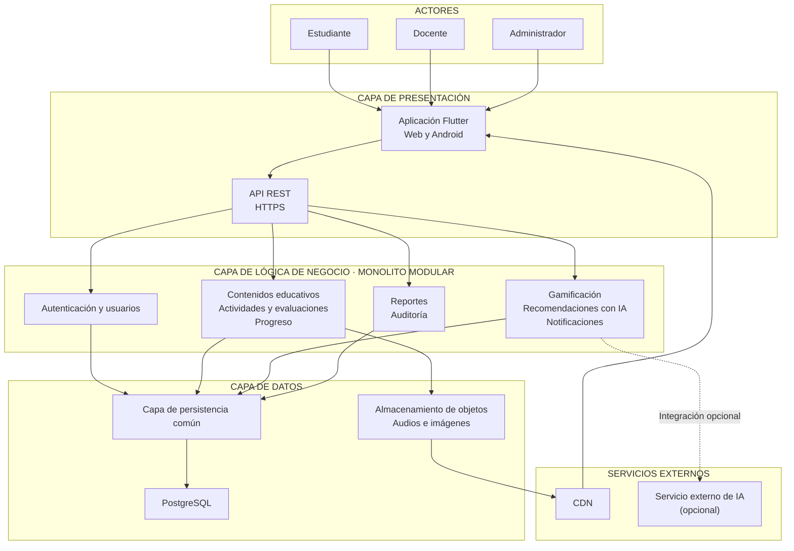

# Arquitectura inicial de APU GO

## Descripción general

APU GO se organiza en tres capas: presentación, lógica de negocio y datos. La aplicación Flutter permite el acceso desde Web y Android. Se comunica mediante HTTPS con una API REST, que atiende las solicitudes y utiliza los módulos de un backend modular.

## Diagrama de arquitectura

## Responsabilidades de las capas

| Capa | Responsabilidad | Componentes de APU GO |
|---|---|---|
| Presentación | Permitir la interacción con los usuarios y recibir las solicitudes. | Aplicación Flutter para Web y Android; entrada mediante API REST. |
| Lógica de negocio | Aplicar las reglas de aprendizaje y administrar las funciones del sistema. | Autenticación y usuarios, contenidos, actividades y evaluaciones, progreso, gamificación, recomendaciones, reportes, notificaciones y auditoría. |
| Datos | Almacenar y recuperar la información. | Capa de persistencia, PostgreSQL y almacenamiento de objetos para archivos multimedia. |

## Sistemas externos

- **CDN:** distribuye los audios, imágenes y recursos estáticos.
- **Servicio externo de IA:** puede apoyar las recomendaciones y la retroalimentación. Su integración es opcional y debe respetar la privacidad de los estudiantes.

## Decisiones iniciales

El backend se plantea como un monolito modular para separar responsabilidades y facilitar su mantenimiento por un desarrollador individual. Los módulos comparten una capa de persistencia. PostgreSQL guarda los datos transaccionales, mientras que los archivos multimedia se almacenan por separado.