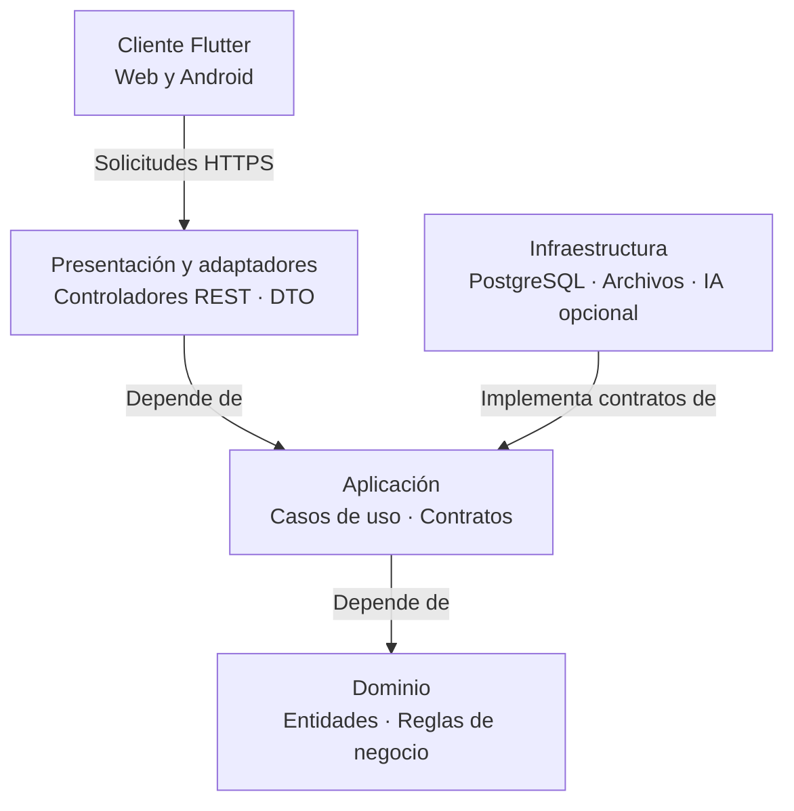
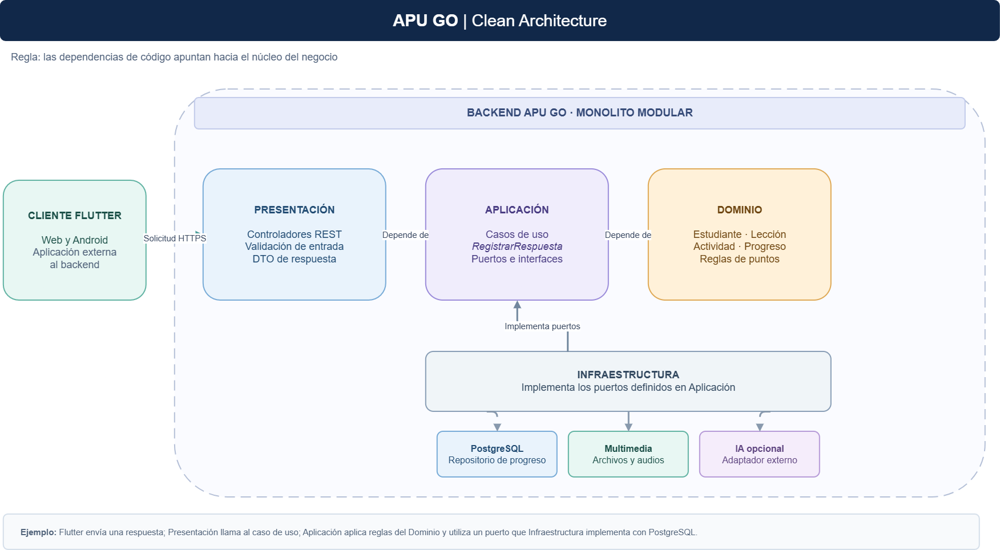

# Enfoque arquitectónico de APU GO

## Enfoque seleccionado

Se propone aplicar **Clean Architecture** dentro del backend modular de APU GO. Su regla principal es que las dependencias del código apunten hacia las reglas del negocio: el dominio no debe depender de Flutter, PostgreSQL, frameworks ni servicios externos de IA.

Flutter es un cliente separado que consume la API REST. Dentro del backend, la API recibe solicitudes y delega el trabajo a los casos de uso.

## Responsabilidades de las capas

| Capa | Responsabilidad en APU GO | Ejemplos |
|---|---|---|
| Dominio | Representar los conceptos y reglas fundamentales del aprendizaje. | Estudiante, lección, actividad, respuesta, progreso y reglas para otorgar puntos. |
| Aplicación | Coordinar los casos de uso y definir los contratos que necesita para acceder a datos o recomendaciones. | ConsultarLecciones, RegistrarRespuesta, ActualizarProgreso y ObtenerRecomendaciones. |
| Presentación y adaptadores | Recibir solicitudes REST, validar su formato y transformar las respuestas para el cliente. | Controladores de actividades y progreso; DTO de entrada y salida. |
| Infraestructura | Implementar los contratos definidos por la aplicación mediante tecnologías concretas. | Repositorios PostgreSQL, almacenamiento de audios e imágenes e integración opcional con IA. |

## Regla de dependencias

## Ejemplo: resolver una actividad

1. El estudiante envía su respuesta desde Flutter.
2. Un controlador REST recibe la solicitud y llama al caso de uso `RegistrarRespuesta`.
3. El caso de uso aplica las reglas del dominio para evaluar la respuesta y actualizar el progreso.
4. El caso de uso utiliza contratos para guardar el resultado.
5. La infraestructura implementa esos contratos con PostgreSQL.
6. El controlador devuelve el resultado al cliente.

## Beneficios para APU GO

- Permite modificar la persistencia o una integración externa sin cambiar innecesariamente las reglas de aprendizaje.
- Facilita probar los casos de uso con implementaciones de prueba de sus contratos.
- Mantiene separadas las responsabilidades de los módulos del backend.
- Responde al driver **DA06: mantenibilidad y evolución modular** y a la decisión **ADR-002: aplicar Clean Architecture**.

