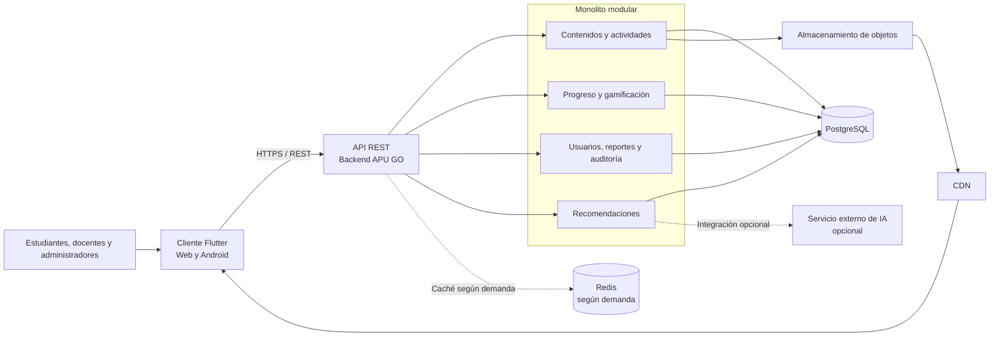
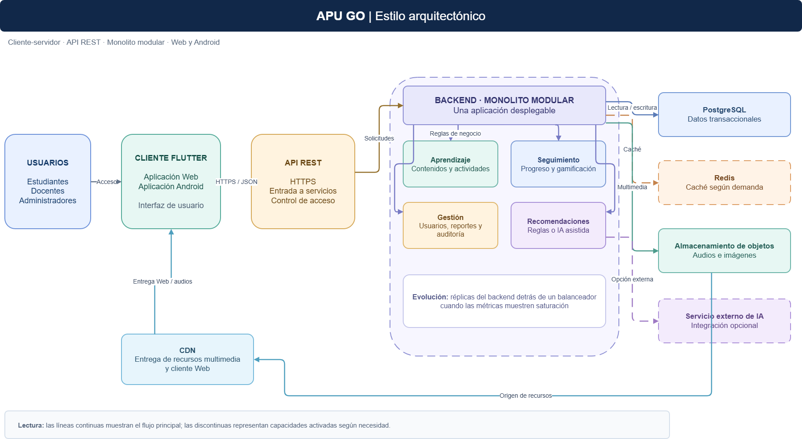

# Estilo arquitectónico de APU GO

## Estilo seleccionado

APU GO seguirá un estilo **cliente-servidor**, con una aplicación Flutter para Web y Android y un **backend de tipo monolito modular**. El cliente se comunicará con el backend mediante una API REST sobre HTTPS.

El backend se desplegará inicialmente como una sola aplicación. Sus funcionalidades estarán separadas en módulos con responsabilidades definidas. Si las pruebas y métricas muestran saturación, se podrán agregar réplicas del backend detrás de un balanceador de carga.

## Componentes principales

| Componente | Responsabilidad |
|---|---|
| Flutter Web y Android | Presentar lecciones, actividades, progreso y funciones según el rol del usuario. |
| API REST | Recibir solicitudes del cliente y dirigirlas a las funciones correspondientes. |
| Backend modular | Aplicar las reglas de usuarios, aprendizaje, gamificación, recomendaciones, reportes y auditoría. |
| PostgreSQL | Almacenar los datos transaccionales. |
| Almacenamiento de objetos y CDN | Guardar y distribuir audios, imágenes y otros recursos multimedia. |
| Redis | Reducir consultas repetitivas cuando las pruebas de rendimiento justifiquen incorporarlo. |
| Servicio externo de IA | Apoyar recomendaciones o retroalimentación si se decide habilitar esa integración. |

## Diagrama del estilo arquitectónico

## Diagrama del estilo arquitectónico

*Figura 1. Estilo arquitectónico de APU GO. Fuente: elaboración propia.*

## Justificación

El monolito modular permite construir y desplegar una sola aplicación backend, manteniendo separadas las responsabilidades de cada módulo. Es una opción viable para el desarrollo individual de APU GO y responde al driver DA06 de mantenibilidad. La comunicación mediante API REST permite que los clientes Web y Android utilicen los mismos servicios.

La organización modular y la ausencia de sesiones locales en cada instancia permiten plantear réplicas del backend cuando la demanda lo requiera. Esta capacidad deberá comprobarse con pruebas de carga; no se considera validada solo por el diseño.

## Relación con las decisiones

- **ADR-001:** monolito modular.
- **ADR-003:** comunicación entre Flutter y el backend mediante API REST.
- **ADR-004:** caché incorporada según mediciones.
- **ADR-006:** almacenamiento multimedia separado de PostgreSQL.